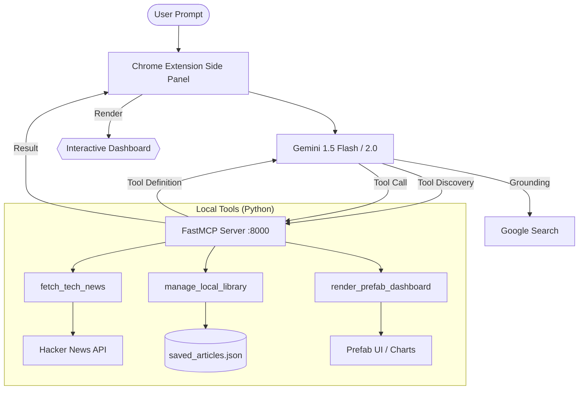

# 🤖 AgentCurator

> **Precision AI Research Assistant** — A production-ready orchestration of a Chrome Extension Side Panel and a local Python MCP backend.

AgentCurator bridges the gap between high-level AI reasoning and local system capabilities. It empowers users to fetch trending news, ground facts with Google Search, deduplicate findings against a local JSON ledger, and visualize data through a beautiful, interactive Prefab dashboard.

---

## ✨ Key Features

- **🌐 Hybrid Research:** Seamlessly combines niche community data from **Hacker News** with broad factual grounding via **Google Search**.
- **📚 Local Memory:** Persistent JSON library (`saved_articles.json`) for article deduplication and historical research tracking.
- **📊 Dynamic Dashboards:** Automatically generates rich UI dashboards using **Prefab UI** and **Frappe Charts** (Bar, Pie, Line, Radar, etc.).
- **🧩 MCP Native:** Built on the **Model Context Protocol (FastMCP)** for robust, standardized communication between the LLM and local tools.
- **⚡ persistence:** Operates in a Chrome **Side Panel** (Manifest V3) for an uninterrupted, always-available research companion.

---

## 🏗️ Architecture



---

## 🚀 Getting Started

### 1. Backend Setup (MCP Server)
The backend requires Python 3.14+ and `uv` (recommended) or `pip`.

```bash
# Clone the repo
git clone https://github.com/yourusername/agent_curator.git
cd agent_curator

# Install dependencies
pip install -e .

# Start the server
python main.py
```
*The server will run on `http://localhost:8000`. Keep this terminal open.*

### 2. Frontend Setup (Chrome Extension)
1. Open Chrome and navigate to `chrome://extensions/`.
2. Enable **Developer mode** (top right).
3. Click **Load unpacked** and select the `extension` folder in this repository.
4. Click the AgentCurator icon in your toolbar to open the **Side Panel**.
5. Click the gear icon (⚙️) to enter your **Gemini API Key**.

---

## 🛠️ Integrated Tools

| Tool | Capability | Source/Target |
|---|---|---|
| `fetch_tech_news` | Retrieves trending tech discussions and startup news. | Hacker News (Algolia) |
| `manage_local_library` | Handles deduplication (`check_duplicates`) and permanent storage (`save_new`). | `saved_articles.json` |
| `render_prefab_dashboard` | Compiles research into a rich HTML dashboard with charts and summaries. | Prefab UI + Frappe Charts |
| **Google Search** | (Built-in) Provides real-time factual grounding for general queries. | Google Search Index |

---

## 📖 Usage Example

**Prompt:**
> "Find the top 3 articles on 'Quantum Computing' from Hacker News. Compare them with recent breakthroughs found on Google Search. Save the new ones and show me a dashboard with a market interest chart."

**Execution Flow:**
1. **Search:** Gemini calls `fetch_tech_news` and performs a grounded Google Search.
2. **Filter:** Gemini calls `manage_local_library(check_duplicates)` to see what's already saved.
3. **Summarize:** Gemini generates concise, 1-sentence summaries for the new findings.
4. **Persist:** Gemini calls `manage_local_library(save_new)` to update your local ledger.
5. **Visualize:** Gemini calls `render_prefab_dashboard` with curated cards and a relevant chart.
6. **Result:** The Side Panel updates instantly with a professional research report.

---

## 🛠️ Tech Stack

- **Backend:** Python 3.14, [FastMCP](https://github.com/jlowin/fastmcp), FastAPI, Uvicorn, Prefab-UI.
- **Frontend:** JavaScript (ES6+), Manifest V3, Gemini SDK, Frappe Charts.
- **Storage:** Local JSON filesystem.
- **AI:** Google Gemini 1.5 Flash / 2.0 with Dynamic Grounding.

---

## 📝 License

MIT © [Swapniel](https://github.com/swapniel)
